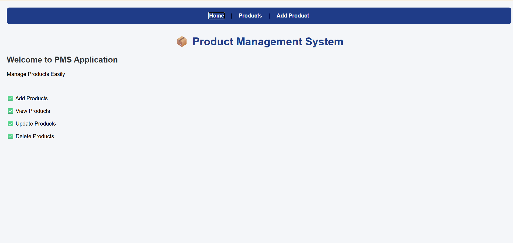
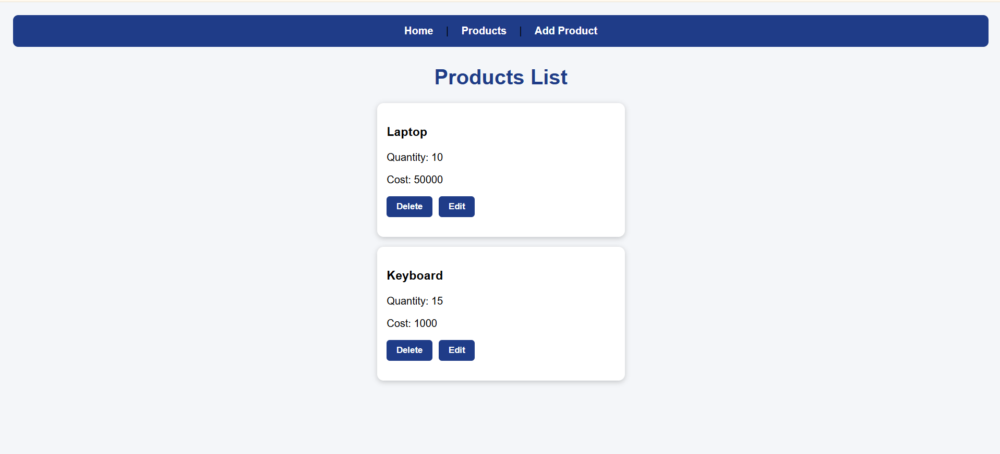
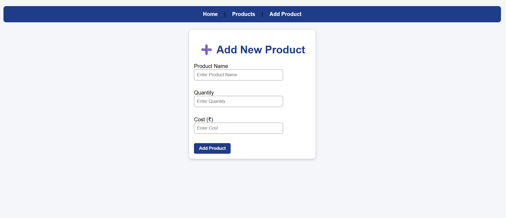
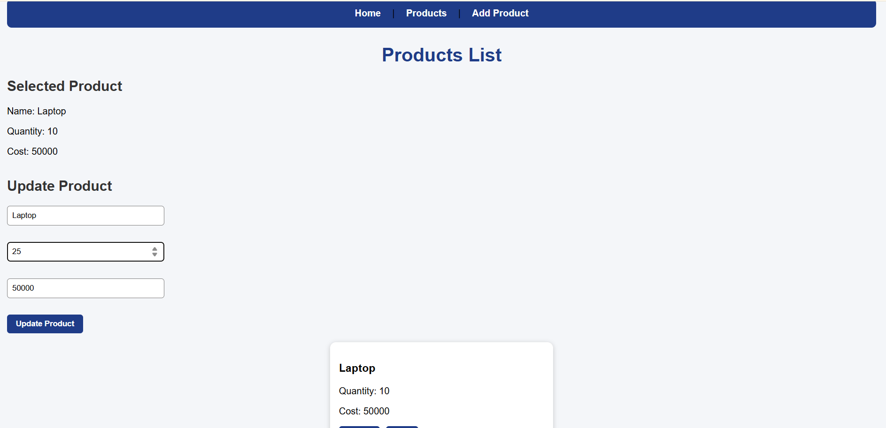

# 📦 Product Management System

## 📌 Overview

A full-stack Product Management System built using React.js, Spring Boot, and MySQL.

The application allows users to:

- Add Products
- View Products
- Update Products
- Delete Products

through a clean and responsive web interface.

---

## 🚀 Features

- ➕ Add Products
- 📋 View Products
- ✏️ Update Products
- 🗑️ Delete Products
- 🔄 REST API Integration
- 📱 Responsive UI
- 💾 MySQL Database

---

## 🛠 Technologies Used

### Frontend
- React.js
- React Router
- JavaScript
- HTML
- CSS
- Fetch API

### Backend
- Java
- Spring Boot
- Spring Data JPA

### Database
- MySQL

### Tools
- Eclipse / STS
- VS Code
- MySQL Workbench
- Postman
- Git
- GitHub

---

## 📸 Application Screenshots

### 🏠 Home Page


### 📋 Products List


### ➕ Add Product


### ✏️ Update Product


---

## ✨ Features Implemented

- React Functional Components
- React Hooks (useState, useEffect)
- React Router
- CRUD Operations
- REST API Integration
- Controlled Components
- Conditional Rendering
- Responsive Card Layout

---

## 🔗 REST API Endpoints

| Method | Endpoint | Description |
|--------|----------|-------------|
| GET | /app/readall | Get all products |
| POST | /app/insert | Add product |
| PUT | /app/update/{id} | Update product |
| DELETE | /app/delete/{id} | Delete product |

---

## ▶️ How to Run

### Backend

1. Import into STS/Eclipse
2. Configure MySQL
3. Run Spring Boot

### Frontend

```bash
npm install
npm run dev

## 🎯 Learning Outcomes

This project helped me strengthen my understanding of:

- React Functional Components
- React Hooks (useState, useEffect)
- React Router
- REST API Integration
- Fetch API
- Spring Boot REST APIs
- CRUD Operations
- MySQL Database Integration
- State Management
- Full Stack Development
